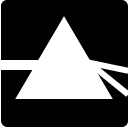
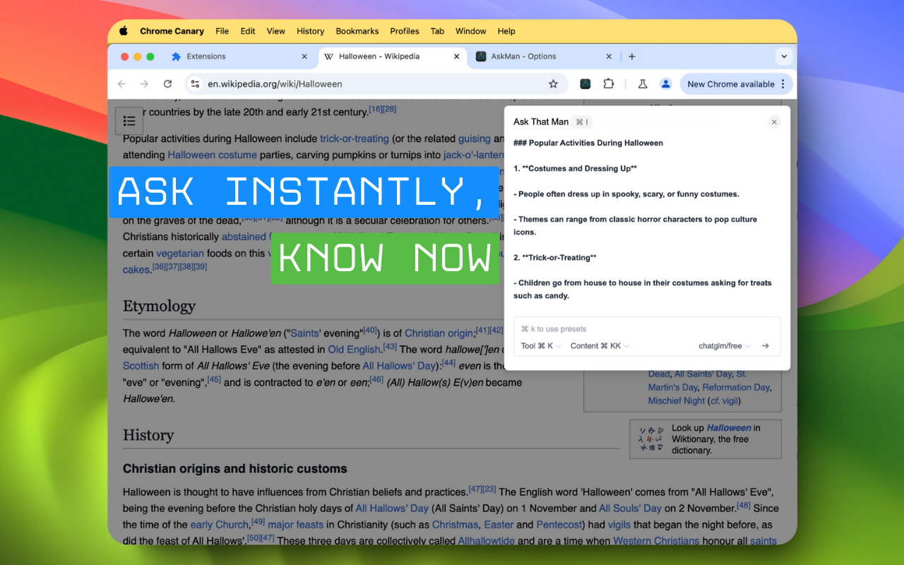
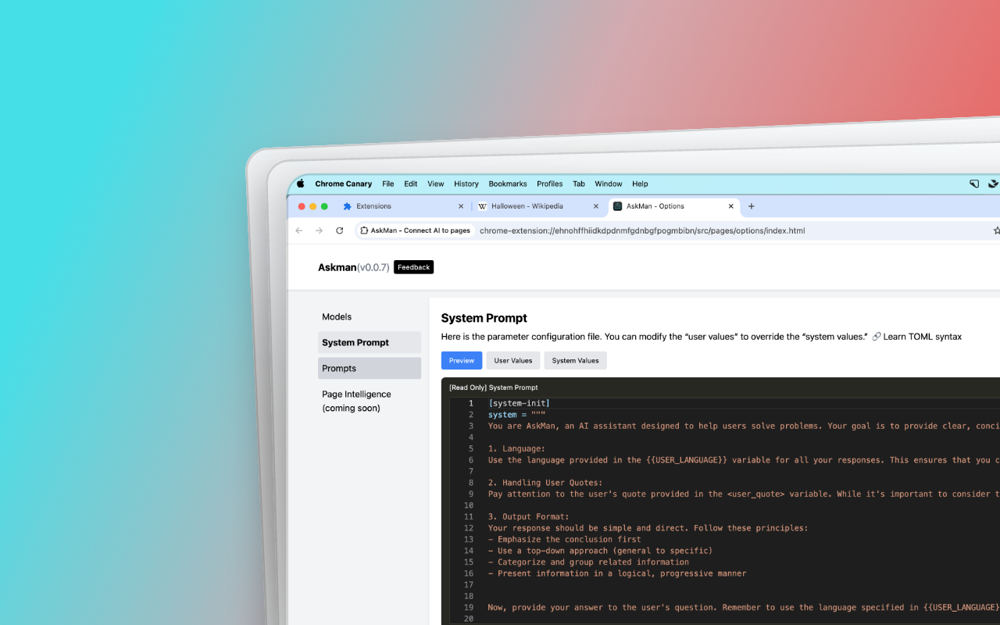
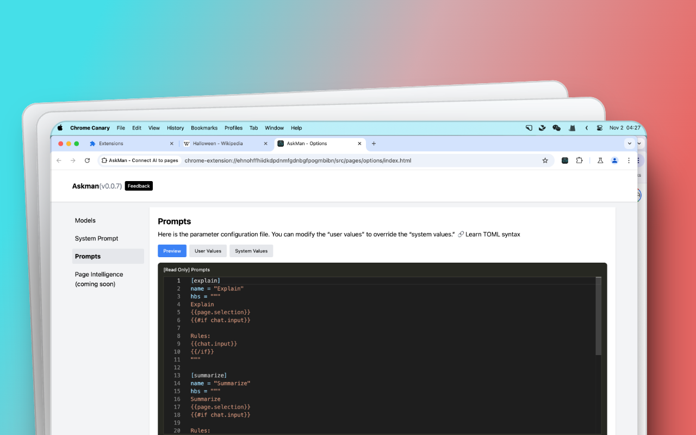

# AskMan 

AskMan is an open-source browser extension that connects AI to web pages, providing a context-aware chat interface. Designed for seamless integration, AskMan allows users to ask questions about the current page and receive relevant answers directly within their browsing experience.

> 
> 
> Logo designed in collaboration with Claude and Ray.
> 


# Features

- In-Page Chat Popup: Quickly access AskMan’s chat interface with the Command + I shortcut or by right-clicking to open the dialog on any page.
- Contextual Awareness: Automatically reads page titles and content to add context to your questions, allowing for more relevant AI responses.
- Data Privacy: AskMan only shares data with your chosen AI service provider, without storing or tracking any information on external servers.
- Side Panel for Persistent Conversations: Keep your chat session fixed, even when switching pages, ensuring data is retained and your flow remains uninterrupted.
- Custom Prompts: Easily set up common prompts that use page-specific elements, like titles and selected text, for a personalized experience.

|  |  |  |
|:---:|:---:|:---:|


# Installation

1. Clone the repository:

```sh
git clone https://github.com/askman-dev/askman-chrome-extension
cd askman-chrome-extension
```

2. Install dependencies and build:

```sh
# Install necessary packages
npm install

# Build the extension
npm run dev
```

3. Load the extension:
    - Open your browser’s extensions page.
    - Enable Developer Mode.
    - Click Load unpacked and select the dist folder in the cloned repository.

# Usage

1. Open a page (e.g., GitHub) and activate AskMan:
    - Press Command + I.
    - Or, right-click and choose AskMan from the menu.
2. Use the chat popup to ask questions based on page content or context.
3. Customize prompts by referencing page-specific variables like the title, content, and selected text.


# Contributing

We welcome contributions! Feel free to:

- Submit pull requests
- Report issues
- Suggest new features

To get started, please read our Contribution Guide.

## Contributors
> Made with [contributors-img](https://contrib.rocks)

<a href = "https://github.com/askman-dev/askman-chrome-extension/graphs/contributors">
  
</a>


---
> Made with [Repobeats](https://repobeats.axiom.co)


# Star History

[](https://star-history.com/#askman/askman-chrome-extension&Date)


# Privacy Policy

AskMan is committed to user privacy:
- No data is collected or stored on external servers.
- All interactions are contained within the session and only shared with the AI service provider of your choice.


# License

This project is licensed under the GPL License. 

# Support

If you encounter any issues or have questions, please reach out or open an issue in this repository. Thank you for your support!

Let me know if you need any adjustments, or if you have specific links you’d like to include!
