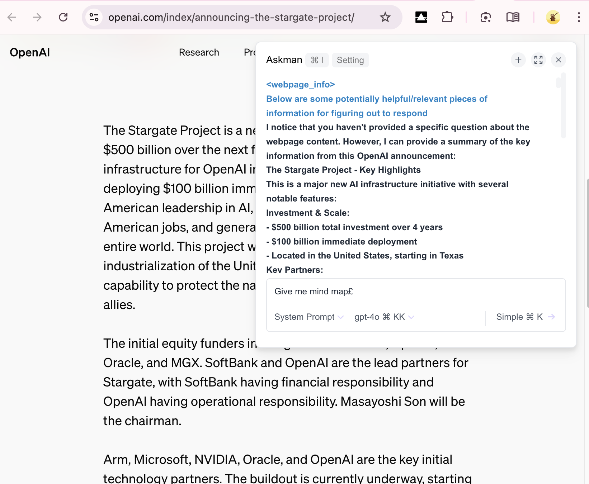

# Askman 

Askman is an open-source browser extension that connects AI to web pages, providing a context-aware chat interface. Designed for seamless integration, Askman allows users to ask questions about the current page and receive relevant answers directly within their browsing experience.

  Logo designed in collaboration with Claude and Ray.

# Install
https://chromewebstore.google.com/detail/askman-connect-ai-to-page/gpopfjaknekkfaepclelildfnmfgdjnd


# Features

## Page Assistant
- **In-Page Chat Interface**: Quickly access AskMan's chat interface with Command + I shortcut or right-click context menu on any webpage
- **Contextual Awareness**: Automatically extracts page content, titles, and selected text for AI-powered assistance
- **Advanced Model Support**: Multi-provider AI integration (OpenRouter, SiliconFlow, etc.) with custom streaming for reasoning models
- **Tool Integration**: Handlebars-based prompt templates with dynamic page context injection
- **Agent & Chat Modes**: Unified interface supporting both conversational and specialized agent interactions

## ThoughtPrism Multi-Column Interface
- **Advanced Conversation Management**: Multi-column canvas for complex dialog exploration and thought organization
- **Conversation Branching**: Create alternate conversation paths from any message for exploring different ideas
- **Focus Mode**: Double-click columns for distraction-free reading with optimal text layout
- **Canvas Navigation**: Zoom, pan, and organize conversation landscapes with intelligent grid positioning
- **Cross-Column Context**: Messages can reference and build upon conversations in other columns

## Configuration & Privacy
- **TOML-Based Configuration**: Modern configuration system for models, tools, and user preferences
- **Data Privacy**: All interactions remain local or go directly to your chosen AI provider - no external data collection
- **Dual LLM Architecture**: Supports both Vercel AI SDK and LangChain implementations for maximum flexibility
- **Custom Prompt Templates**: Create reusable prompts with page-specific variables (title, content, selected text)
|  |  |  |
|:---:|:---:|:---:|


# Installation

1. Clone the repository:

```sh
git clone https://github.com/askman-dev/askman-chrome-extension
cd askman-chrome-extension
```

2. Install dependencies and build:

```sh
# Install necessary packages (using pnpm - configured in packageManager)
corepack enable && corepack install
pnpm install

# For development with Hot Module Reload
pnpm dev

# For production build
pnpm build
```

3. Load the extension:
    - Open your browser’s extensions page.
    - Enable Developer Mode.
    - Click Load unpacked and select the dist folder in the cloned repository.

# Usage

## Page Assistant
1. Open any webpage and activate Askman:
    - Press **Command + I** (Mac) or **Ctrl + I** (Windows/Linux)
    - Or right-click and choose "Askman" from the context menu
2. Use the chat interface to ask questions about page content or context
3. Switch between Chat and Agent modes using the toggle
4. Select from available prompt templates using the tool dropdown
5. Customize system prompts and choose different AI models

## ThoughtPrism Multi-Column Interface
1. Open the extension options or navigate to the ThoughtPrism page
2. Create multiple conversation columns for complex thought exploration
3. Use **right-click on any message** to branch into new conversation paths
4. **Double-click on columns** to enter focus mode for distraction-free reading
5. **Drag and zoom** the canvas to organize your conversation landscape
6. Reference content between columns for cross-conversation insights


# Contributing

We welcome contributions! Feel free to:

- Submit pull requests
- Report issues
- Suggest new features

To get started, please read our Contribution Guide.

## MCP Server Integration

Askman supports integration with MCP (Model Context Protocol) servers that use HTTP transport. These servers can provide additional capabilities like database access, file system operations, and third-party service integrations.

📚 **[View MCP Servers Documentation](./docs/mcp-servers.md)** - Complete catalog of HTTP-compatible MCP servers

Key features:
- **HTTP Protocol Support**: Compatible with web-based Chrome extension environment
- **Secure Authentication**: Token-based authentication for secure server access
- **Extensive Server Catalog**: 10+ documented servers including GitHub, SQLite, Google Drive, and more
- **Easy Configuration**: TOML-based configuration system for quick setup

## Contributors
> Made with [contributors-img](https://contrib.rocks)

<a href = "https://github.com/askman-dev/askman-chrome-extension/graphs/contributors">
  
</a>


---
> Made with [Repobeats](https://repobeats.axiom.co)


# Star History

[](https://star-history.com/#askman/askman-chrome-extension&Date)


> 
> <a href="https://www.buymeacoffee.com/chessjoej"></a>

# Privacy Policy

Askman is committed to user privacy:
- No data is collected or stored on external servers.
- All interactions are contained within the session and only shared with the AI service provider of your choice.


# License

This project is licensed under the GPL License. 

# Support

If you encounter any issues or have questions, please reach out or open an issue in this repository. Thank you for your support!

Let me know if you need any adjustments, or if you have specific links you’d like to include!
